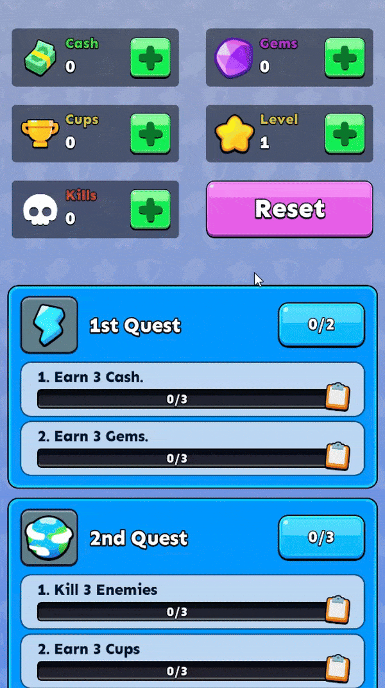
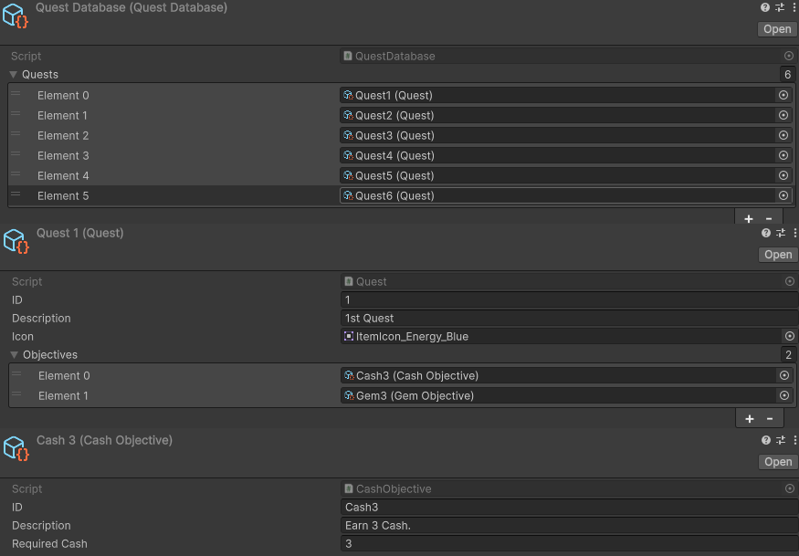

# Modular Quest System
A modular, event-driven quest system designed for Unity using `ScriptableObject` architecture. This system supports runtime progress tracking, flexible quest creation, and easy to design quests with scriptable objects. Easily define quests and objectives in the Unity Editor without writing additional code, with full support for save/load and chained objectives.




## Features
- **Scriptable Architecture**: Define Quests and Objectives as standalone ScriptableObject assets — easy to create, reuse, and extend.
- **Modular Objectives**: Add new types of Objectives (e.g. `Level`, `Cash`, etc) by extending `ObjectiveBase`.
- **Runtime Progress**: Track player progress (`e.g. 3/5 gems`) with built-in progress serialization and automatic quest evaluation.
- **Event-Driven**: Responds to game events (like cash collected, location reached, etc) using a decoupled event system.
- **Save/Load Support**: Stores quest and objective states, including partial progress, via JSON.
- **Inspector-Friendly**: Design quests entirely in the Editor — no code required for designers.
- **Debugging**: Easily test and track quest state via custom demo UI.

## Requirements
- **Unity Version**: 6000.0.41f1


## Run
- Clone the repository:
   ```bash
   git clone https://github.com/ALI-P48/QuestSystem.git
   ```
- Open the project in Unity.
- Open `SampleScene` in editor.
- Make sure a portrait screen size is selected and Hit play.


## Configuration
- **Quest Database**: A list of all quests.
- **New Quest**: Simply create a quest using create menu > ScriptableObjects/Quest.
- **Edit Quests**: You can edit a quest by simply editing the scriptable object.
- **Add Objective**: Add a new objective using create menu > ScriptableObjects/Objectives.

